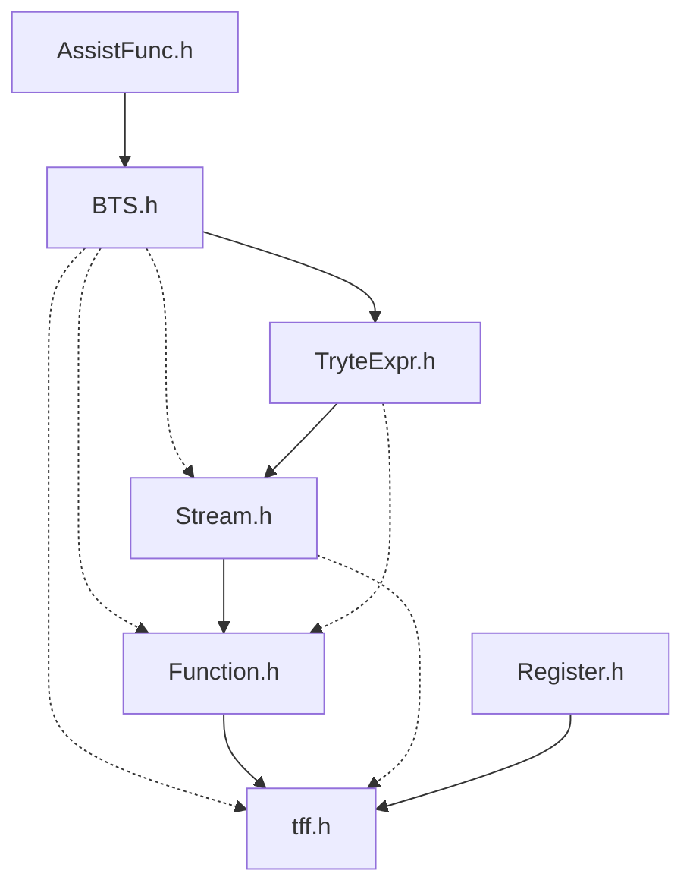

```mermaid
graph TB
    AssistFunc.h --> BTS.h
    BTS.h .-> Function.h
    BTS.h .-> Stream.h
    BTS.h .-> tff.h
    BTS.h --> TryteExpr.h
    Function.h --> tff.h
    Stream.h --> Function.h
    Stream.h .-> tff.h
    TryteExpr.h .-> Function.h
    TryteExpr.h --> Stream.h
    Register.h --> tff.h
```